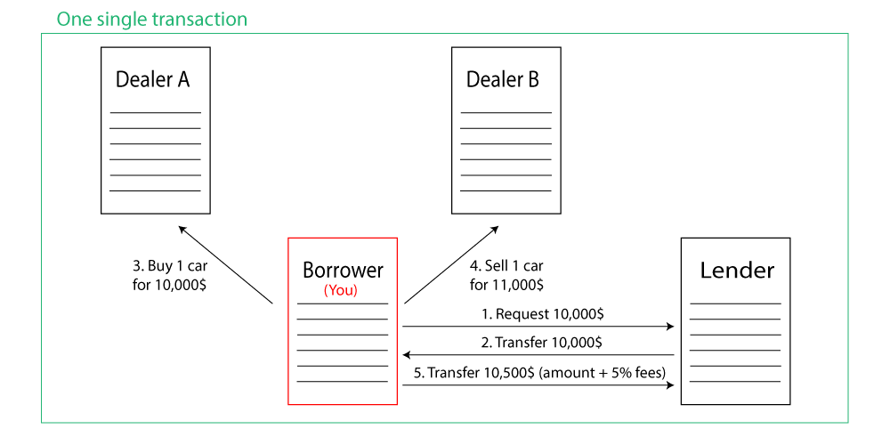

# Simple Flashloan

## What is a flashloan ?

Flash loans are loans — they involve a lender loaning money to a borrower, with the expectation that they’ll get paid back. But there are some important distinctions. Namely, flash loans utilize smart contracts because it encapsulate the entire transaction — from borrowing to paying back — in one single, instant transaction.

## What's happening ( simplified ) ?



## How to run it

- Install Ganache (Local Eth blockchain) (https://trufflesuite.com/ganache/)
- Install **truffle** globally

```
    npm i -g truffle
```

- Clone repo
- Run this command to install required smart contract libraries

```
    npm i
```

### To deploy smart contract

<br/>

```
    truffle migrate
```

### To run tests

<br/>

```
    truffle test
```
